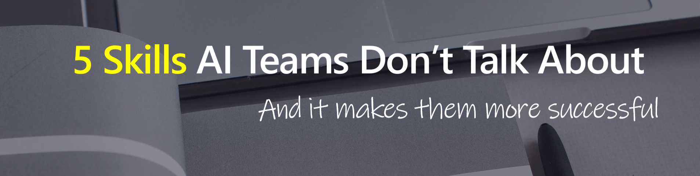
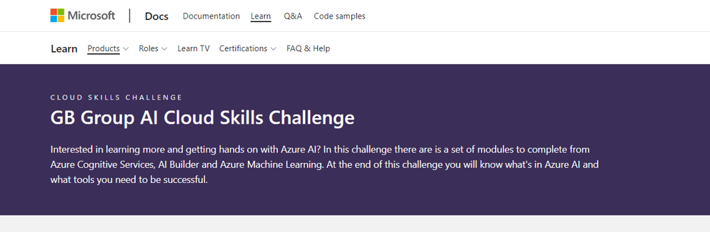

# 5 Skills AI Teams don't talk about that make them more successful

Many things make AI projects a success - but what are the subtle areas that are less spoken about?   

In this 30 min session we will explore a new theme every 5 mins *(so bring your coffee with you!)*. Ranging from choosing and experimenting with new AI technologies, to the importance of storytelling with data so everyone understands your project and outcomes.   

To illustrate each theme we will explore services and tooling from Microsoft Azure that support your AI Solutions throughout their lifecycle.   

This session will not be the end of your journey, but just the start - I hope to inspire you to want to learn more and help recommend some concrete next steps.

**Take Part in the GB Group Cloud Skills Challenge - [Click Here](https://docs.microsoft.com/learn/challenges?id=1ea9b107-5af1-4df5-b9c7-63608201ff12&WT.mc_id=aiml-0000-amynic)**

# The 5 Skills

## Experimenting

* **AI Builder**
    * [Demo](https://youtu.be/Y73cWlzgOmE)
    * [Learning Resources](https://docs.microsoft.com/learn/paths/bring-ai/?WT.mc_id=aiml-0000-amynic)
* **Cognitive Services**
    * [Demo](https://youtu.be/w0jygqjLmB0)
    * [Learning Resources](https://docs.microsoft.com/users/amyboyd/collections/r35dckzpz7327o?WT.mc_id=aiml-0000-amynic)
    * [Extended Learning](https://docs.microsoft.com/users/amyboyd/collections/p3j1cdx1zjz1k8?WT.mc_id=aiml-0000-amynic)
* **Azure Machine Learning**
    * [Learning Resources](https://docs.microsoft.com/users/amyboyd/collections/nk7oskmdmyd35x?WT.mc_id=aiml-0000-amynic)
    * [Extended Learning](https://docs.microsoft.com/users/amyboyd/collections/ok45szjdq517j2?WT.mc_id=aiml-0000-amynic)

## Working with Others

* [Orchastrate Machine Learning Pipelines](https://docs.microsoft.com/learn/modules/create-pipelines-in-aml/?WT.mc_id=aiml-0000-amynic)
* [Deploy Real-Time Machine Learning Models](https://docs.microsoft.com/learn/modules/register-and-deploy-model-with-amls/?ns-enrollment-type=LearningPath&ns-enrollment-id=learn.data-ai.build-ai-solutions-with-azure-ml-service&WT.mc_id=aiml-0000-amynic)
* [Deploy Batch Inference Models with Azure Machine Learning](https://docs.microsoft.com/learn/modules/deploy-batch-inference-pipelines-with-azure-machine-learning/?ns-enrollment-type=LearningPath&ns-enrollment-id=learn.data-ai.build-ai-solutions-with-azure-ml-service&WT.mc_id=aiml-0000-amynic)

## Always Learning

Communities to get involved with:
* [Global AI Community](https://globalai.live)
* [Open Data Science Community (ODSC)](https://odsc.com)

Learning Resources on Microsoft Learn:
* [GB Group Cloud Skills Challenge](https://aka.ms/challenge-gbg)
* [MS Learn **Power Platform** Collection](https://docs.microsoft.com/users/amyboyd/collections/xzx3a2nznjnq8q?WT.mc_id=aiml-0000-amynic)
* [MS Learn **Azure Cognitive Services** Collection](https://docs.microsoft.com/users/amyboyd/collections/r35dckzpz7327o?WT.mc_id=aiml-0000-amynic)
* [MS Learn **Azure Machine Learning** Collection](https://docs.microsoft.com/users/amyboyd/collections/nk7oskmdmyd35x?WT.mc_id=aiml-0000-amynic)

## Reporting

* [Review a full session on Tailwind Traders Reporting shown](https://aka.ms/aiml21repo)
* [**Tutorial:** Consume Azure Machine Learning models in Power BI](https://docs.microsoft.com/power-bi/connect-data/service-aml-integrate?context=azure%2Fmachine-learning%2Fcontext%2Fml-context&WT.mc_id=aiml-0000-amynic)

## Responsible AI

* [Microsoft Responsible AI page](www.microsoft.com/ai/responsible-ai-resources)
* [Responsible ML in Azure Machine Learning](https://docs.microsoft.com/users/amyboyd/collections/1eynbpzr861oqp?WT.mc_id=aiml-0000-amynic):
    * Explore Differential Privacy
    * Explain Machine Learning Models with Azure Machine Learning
    * Detect and Mitigate Unfairness in models with Azure Machine Learning

## Accessibility

Accessibility is everyones job check out [aka.ms/MicrosoftOneMoreThing](https://aka.ms/MicrosoftOneMoreThing/) to learn more